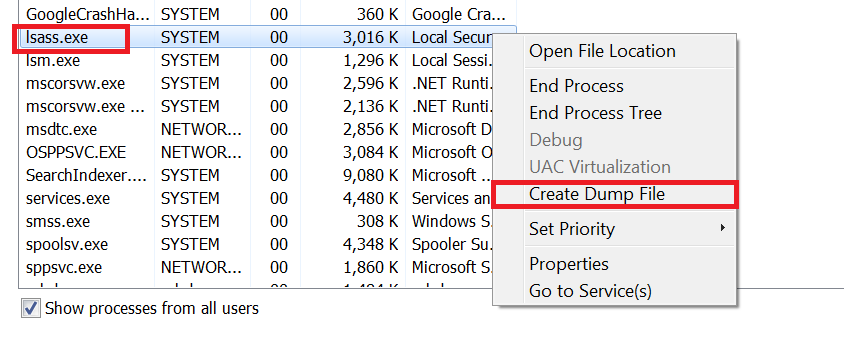

# Different ways of dumping lsass
As part of my "coming back to Windows security" phase, I've decided to write a short blogpost about the significance and methodology of dumping lsass.  
While these are not novel techniques, I think summarizing ideas here would make sense, especially if you're stuck at 2-3 methods that are all monitored.

## What is lsass
The `Local Security Authority Subsystem Service (LSASS)` is a critical Windows process (`lsass.exe`) responsible for enforcing the system's security policy.  
It handles authentication, password changes, user logins, token creation, and more, runs as SYSTEM and is tightly integrated into Windows’ trust model.  
In `lsass.exe` memory, you can find authentication credentials for users who have logged into the system.  
Those includes NTLM hashes, Kerberos tickets (TGTs, service tickets), and plaintext credentials (in some cases).  
That makes `lsass` act as a treasure trove for lateral movement and privilege escalation.  
Stealing credentials from LSASS allows attackers to:
- Perform `pass-the-hash (PtH)` or `pass-the-ticket (PtT)`.
- Access network resources without cracking passwords.
- Move laterally without triggering brute-force alarms.

## The basics of dumping lsass
There are a few mitigations against dumping lsass memory, but for now - let's discuss a vanilla OS with no mitigations in place.  
We will therefore decibe naive ways of dumping lsass.  
Generally speaking, dumping lsass requires two things:
1. Getting a process `HANDLE`, e.g. via a call to the [OpenProcess API](https://learn.microsoft.com/en-us/windows/win32/api/processthreadsapi/nf-processthreadsapi-openprocess).
2. Reading the process memory.

### Task manager dumping
While that is probably the least stelthy technique out there, it's quite effective.  
The Windows Task Manager (taskmgr.exe) is a GUI application that allows one to select a process and naively dump it:


The good thing here is that `taskmgr.exe` already runs on a target box ("living-off-the-land"), as well as doing everything for us - it opens a handle to `lsass.exe` and dumps its contents.  
The bad news is that it's a GUI application, but it could be automated:
1. Save the current foreground window for restoration.
2. Run `taskmgr.exe` and get its process ID (available from a call to [CreateProcessW API](https://learn.microsoft.com/en-us/windows/win32/api/processthreadsapi/nf-processthreadsapi-createprocessw).
3. Wait a bit and find the Task Manager window via the [FindWindowW API](https://learn.microsoft.com/en-us/windows/win32/api/winuser/nf-winuser-findwindoww). Interestingly, it's quite easy to find since that Window has a class name "TaskManagerWindow".
4. Send keystrokes to the Task Manager window via the [SendInput API](https://learn.microsoft.com/en-us/windows/win32/api/winuser/nf-winuser-sendinput). We can inject the keystrokes that spell out "Local Security Authority", followed by the special "menu" keyboard input (`VK_APPS`), and then the letter "C", which will dump lsass.
5. Use the [EnumWindows API](https://learn.microsoft.com/en-us/windows/win32/api/winuser/nf-winuser-enumwindows) to get the window that shows the filename of the dump file and fetch its contents. Fetching the contents themselves could be dona via the [SendMessageW API](https://learn.microsoft.com/en-us/windows/win32/api/winuser/nf-winuser-sendmessagew) with the Windows Message `WM_GETTEXT`.
6. Kill `taskmgr.exe` and restore the foreground window from step #1.
7. Use the dump file and delete after use.

This might look similar to an [AutoHotkey](https://www.autohotkey.com) implementation - but this is very stitched to `lsass` dumping.

### Rundll-comsvcs-based minidump
Moving forward, the DLL `comsvcs.dll` exposes a `rundll32` interface for its `MiniDump` export.  
It's as simple as running a commandline:
```
"%WINDIR%\System32\rundll32.exe" "%WINDIR%\System32\comsvcs.dll" MiniDump [PID] [PATH] full
```

Where `PID` is the `lsass.exe` process ID and `PATH` is a placeholder for the dump path.  
One annoying thing I discovered was that you cannot quote the `PATH` placeholder, so it cannot contain spaces.  
This minor annoyance could be avoided by converting the path we want to a `Short Path` - via the [GetShortPathNameW API](https://learn.microsoft.com/en-us/windows/win32/api/fileapi/nf-fileapi-getshortpathnamew).

### Procdump
Another simple technique that requires a child process is using [ProcDump](https://learn.microsoft.com/en-us/sysinternals/downloads/procdump) from the SysInternals suite.  
One can download it directly (from https://download.sysinternals.com/files/Procdump.zip) or dump and and run it.  
I mention procdump specifically because it's used by threat actors, as well as very prevalent.

### Minidump API
This technique mainly focuses on the [MiniDumpWriteDump API](https://learn.microsoft.com/en-us/windows/win32/api/minidumpapiset/nf-minidumpapiset-minidumpwritedump).  
Up till this point, we used child processes, but now we're going to use our own code to perform `lsass.exe` dumping.  
To use the `MiniDumpWriteDump` API, we need a `HANDLE` to `lsass.exe`. There are two variants that we will consider for now:

#### Using OpenProcess
This is the most direct and "normal" way of fetching the `lsass.exe` process handle:
1. Finding the process ID of `lsass.exe` with [CreateToolhelp32Snapshot API](https://learn.microsoft.com/en-us/windows/win32/api/tlhelp32/nf-tlhelp32-createtoolhelp32snapshot), as well as [Process32FirstW](https://learn.microsoft.com/en-us/windows/win32/api/tlhelp32/nf-tlhelp32-process32firstw) and [Process32NextW](https://learn.microsoft.com/en-us/windows/win32/api/tlhelp32/nf-tlhelp32-process32nextw) API calls.
2. Use the [OpenProcess](https://learn.microsoft.com/en-us/windows/win32/api/processthreadsapi/nf-processthreadsapi-openprocess) API. For doing a Minidump, we will require the `PROCESS_QUERY_INFORMATION` and `PROCESS_VM_READ` access flags.


#### Stealing an existing handle
a

## Summary of techniques
Here is a nice summary of the techniques, including pros and cons:

| Method                    | Doesn't require child process | Doesn't Require further tooling | Doesn't touch disk | Reliable |
| ------------------------- | ----------------------------- | ------------------------------- | ------------------ | -------- |
| Task manager              | ❌                            | ✅                              | ❌                | ❌       |
| Rundll32-comsvcs minidump | ❌                            | ✅                              | ❌                | ✅       |
| Procdump                  | ❌                            | ❌                              | ❌                | ✅       |
